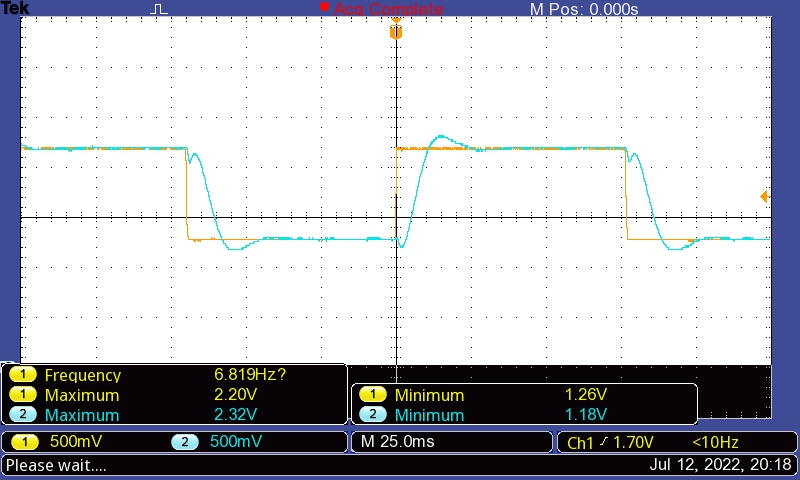
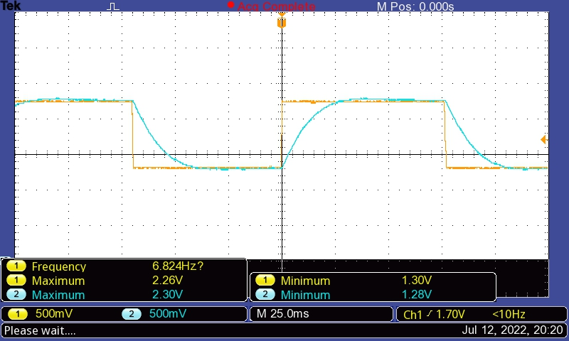

# PI-VHDL

## Overview

This project consists of the implementation of a Proportional-Integral controller on a CPLD. The signals are read using the analog-to-digital converter [ADC0832](https://www.ti.com/product/ADC0832-N). This project posseses the following characteristics:

- Developed in [VHDL](https://en.wikipedia.org/wiki/VHDL);
- It uses the Altera MAX II EPM240 CPLD Development Board with the CPLD model EPM240T100C5;
- It was developed in Quartus Prime Version 21.1.0. In order to use this project, just restore the archived project (`control.qar`) from the project menu in the Quartus Prime software. Or just use the VHDL files directly (It may be easier);
- This project contains many VHDL files that may be useful in other applications:
    - Communication with analog-to-digital converter [ADC0832](./adc0832.vhd);
    - [Digital counter](./counter.vhd);
    - [Frequency divider](./freq_divider.vhd);
    - [Frequency divider with low duty cycle](./freq_divider_low.vhd);
    - [Pulse Width Modulation (PWM)](./pwm.vhd);
    - [Shift register](./shift_register.vhd);
    - [Proportional-Integral controller](./pi_control.vhd);
- In this project, the CPLD receives the data amostrated from the analog-to-digital converter [ADC0832](https://www.ti.com/product/ADC0832-N). This converter has two analog inputs, one corresponds to the setpoint () and another corresponds to the system output (feedback signal). The voltage level of the CPLD is 3V3 while the ADC0832 operates at 5V. This is not a problem for the AD0832 digital inputs (`clk_adc`, `cs_adc` and `di_adc` pins), as this chip identifies high logic level above 2V. On the other hand, to connect the digital output of the converter (pin `do_adc`) to the CPLD, a voltage divider circuit was used to adjust the signal amplitudes;
- List of input and output pins of the CPLD:

| Name        | Pin number  | Description |
| ----------- | ----------- | ----------- |
| clk50MHz    |	PIN_12      | Clock signal of 50 MHz |
| di_adc      |	PIN_40      | Connected to DI pin of the ADC0832 chip |
| do_adc      |	PIN_42      | Connected to DO pin of the ADC0832 chip |
| cs_adc      |	PIN_50      | Connected to CS pin of the ADC0832 chip |
| clk_adc     |	PIN_52      | Connected to DLK pin of the ADC0832 chip |
| output      |	PIN_48      | Output of the controller (adjusted by the PWM method) |

- The PI controller is implemented in the academic form. The [Tustin's discretization method](https://en.wikipedia.org/wiki/Bilinear_transform) (also known as bilinear transform) is used by the VHDL implementation to obtain a discrete implementation of the controller. The Laplace transfer function of the PI controller is:

$$
PI(s) = K_p \left(\displaystyle\frac{T_i s + 1}{T_i s}\right)
$$

## Experimental verification

In order to test the controller and observe its dynamic response, a square wave with a frequency of approximately 7 Hz (shown in yellow in the figure below) was used as the reference (setpoint). This was accomplished using the [LM555](https://www.ti.com/lit/ds/symlink/lm555.pdf) circuit in astable operation. The components used were $R_A = 10k\Omega$, $R_B = 100k\Omega$ and $C = 1 \mu F$. Before this signal was applied to the input of the analog-to-digital converter, it was conditioned using a simple amplifier circuit with offset addition (so values close to the power supply are avoided, and the controller does not go into saturation). The result can be seen in the yellow curve in the figure below.

The plant to be controlled was chosen as first order system, and implemented using a simple RC circuit ($R = 10k\Omega$ and $C = 1 \mu F$). The output signal of the controller (`output` pin) is connected directly to the RC circuit and the capacitor voltage is measured by the second input of the analog-to-digital converter (system output or feedback signal). This signal can be seen in the blue curve in the figure below.

An oscilloscope Tektronix TBS1102B was used to measure the reference and feedback signals (mentioned above) and both are shown in the figure below (setpoint in yellow and feedback in blue). It is observed that the controller output follows the reference and has a dynamic response with little overshoot. In this experiment, the controller gains adjusted are $K_p = 3.04$ and $T_i = 0.00266 s$. The sampling frequency is $10 kHz$, which implies sampling time of $T_s = 0.0001 s$.

A second experiment is presented in the figure below (setpoint in yellow and feedback in blue). Now, the controller gains are adjusted to $K_p = 1.0$ and $T_i = 0.01 s$. The sampling frequency and sampling time are the same as the experiment above.

## Usage

In order to use this project, just restore the archived project (`control.qar`) from the project menu in the Quartus Prime software. Or just use the VHDL files directly (It may be easier).